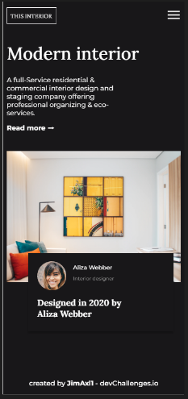
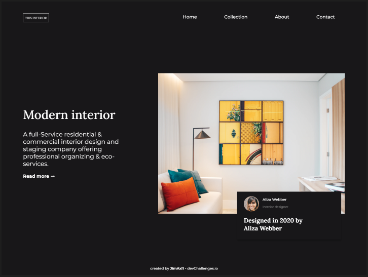

<h1 align="center">Interior consultant | devchallenges.io</h1>

   Solution for a challenge from  <a href="http://devchallenges.io" target="_blank">Devchallenges.io</a>.

  <h3>
    <a href="https://deafening-paste.surge.sh">
      Demo
    </a>
     | 
    <a href="https://github.com/JimAxl1/Interior-consultant">
      Solution
    </a>
     | 
    <a href="https://devchallenges.io/challenges/Jymh2b2FyebRTUljkNcb">
      Challenge
    </a>
  </h3>

## Table of Contents

- [Overview](#overview)
  - [Built With](#built-with)
- [Features](#features)
- [Contact](#contact)

## Overview

- You can see my demo <a href="https://deafening-paste.surge.sh">
      here
    </a>
- It is a simple responsive page

### Built With

- [HTML](https://html.com/)
- [CSS](https://www.w3.org/Style/CSS/Overview.en.html)
- [Javascript](https://www.javascript.com/s)

## Features

This application/site was created as a submission to a [DevChallenges](https://devchallenges.io/challenges) challenge. The [challenge](https://devchallenges.io/challenges/Jymh2b2FyebRTUljkNcb) was to build an application to complete the given user stories.

## Contact

- GitHub [@JimAxl1](https://github.com/JimAxl1)
